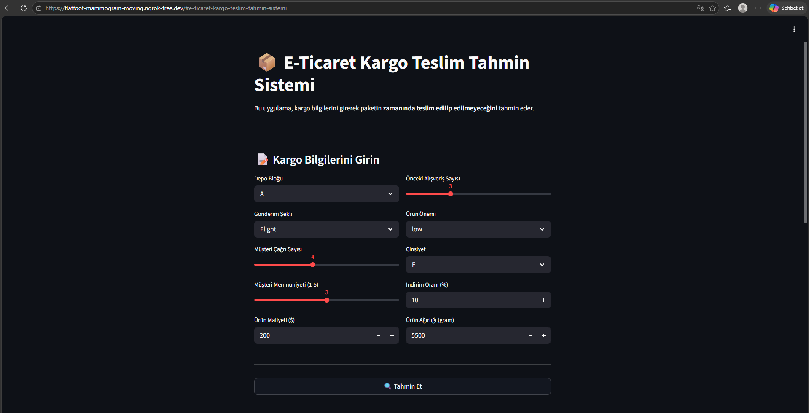
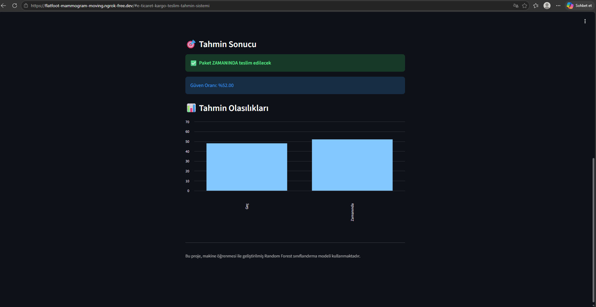

# MTH-Dersi-Teslimat-Durumu-Tahmini

Kargo veri seti kullanılarak paketlerin teslim durumu (teslim edildi / edilmedi) ve teslimat süresi tahmin edilecektir. Amaç, makine öğrenmesi ile kargo performansını analiz edip gelecekteki gönderileri öngörebilen bir model geliştirmektir.

## Proje Hakkında

E-ticaret sektörünün hızla büyümesiyle birlikte kargo teslim performansı müşteri memnuniyeti açısından çok önemli hale geldi. Bu projede kargonun çeşitli özelliklerine bakarak (ağırlık, gönderim şekli, depo bilgisi, müşteri çağrı sayısı, indirim oranı vb.) paketin zamanında teslim edilip edilmeyeceğini tahmin eden bir model geliştirdim.

## Kullanılan Veri Seti

- Kaynak: Kaggle - Customer Analytics Dataset
- Link: https://www.kaggle.com/datasets/prachi13/customer-analytics
- Satır Sayısı: 10.999
- Özellik Sayısı: 10
- Hedef Değişken: Reached.on.Time_Y.N
  - 0 = Paket zamanında teslim edildi
  - 1 = Paket geç teslim edildi

## Kullanılan Teknolojiler

- Python 3
- Pandas, NumPy (veri işleme)
- Scikit-learn (model eğitimi)
- Streamlit (web arayüzü)
- Matplotlib, Seaborn (görselleştirme)
- Joblib (model kaydetme)

## Dosya Yapısı

- kargo_modeli.ipynb: Model eğitim notebook'u
- app.py: Streamlit web uygulaması
- model.pkl: Eğitilmiş Random Forest modeli
- encoders.pkl: Kategorik veri için LabelEncoder'lar
- columns.pkl: Modelin beklediği sütun sırası
- Train.csv: Kullanılan veri seti
- classification.png: Karmaşıklık matrisi görseli
- arayuz.png: Uygulama arayüz ekran görüntüsü
- sonuc.png: Tahmin sonucu ekran görüntüsü
- README.md: Bu dosya

## Kurulum

1. Gerekli kütüphaneleri yükleyin:
   pip install streamlit scikit-learn pandas numpy joblib

2. Uygulamayı çalıştırın:
   streamlit run app.py

3. Tarayıcıda otomatik açılacak. Açılmazsa http://localhost:8501 adresine gidin.

## Model Performansı

- Algoritma: Random Forest Classifier
- Accuracy: 0.67 (yaklaşık %66.7)
- Eğitim/Test Oranı: %80 / %20
- Ağaç Sayısı: 100

### Classification Report

              precision    recall  f1-score   support
           0       0.57      0.70      0.63       895
           1       0.76      0.64      0.70      1305

    accuracy                           0.67      2200

## Ekran Görüntüleri

### Uygulama Arayüzü

### Tahmin Sonucu

### Karmaşıklık Matrisi

Aygül AYDOĞDU
Bu proje MTH-Bulut Bilişim Sistemleri için yapılmıştır.
